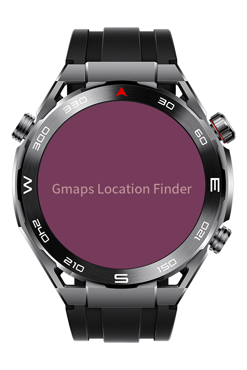
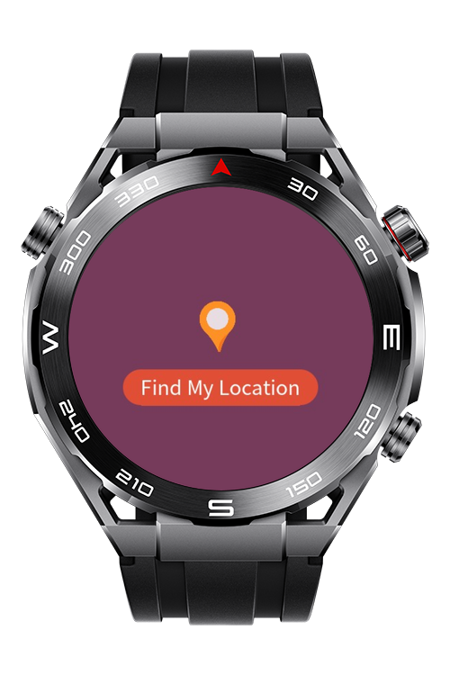
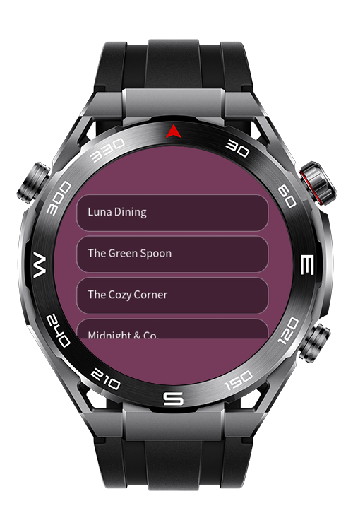

> **Note:** To access all shared projects, get information about environment setup, and view other guides, please visit [Explore-In-HMOS-Wearable Index](https://github.com/Explore-In-HMOS-Wearable/hmos-index).

# Gmaps Calculate

**Gmaps Calculate** This app gets the watch’s current location and calculates the distance to each 
location in the list. It helps to easily see how far the watch is from different places.

# Preview

<div>
  
  
  
</div>

# Use Cases

The app is used to check how far the watch is from preset locations.

# Technology

## Stack
**Languages:** JavaScript                        
**Frameworks:** HarmonyOS SDK 5.0.0 (API 12)                          
**Tools:** DevEco Studio                                                                
**APIs:** @system.geolocation

## Required Permissions

* ```ohos.permission.LOCATION```

# Directory Structure

```
entry/
├── src/main/
│ 
├── src/main/js/MainAbility
│ ├── pages
│ │ ├── findLocation.js
│ │ ├── index.js
│ │ ├── locationList.js
│ │ └── result.js
```

# Constraints and Restrictions
## Supported Device

- Huawei Sport (Lite) Watch GT 4/5/6
- Huawei Sport (Lite) GT4/5 Pro
- Huawei Sport (Lite) Fit 3/4
- Huawei Sport (Lite) D2
- Huawei Sport (Lite) Ultimate

# License

**Gmaps Calculate**  is distributed under the terms of the MIT License

See the [LICENSE](./LICENSE) for more information.
